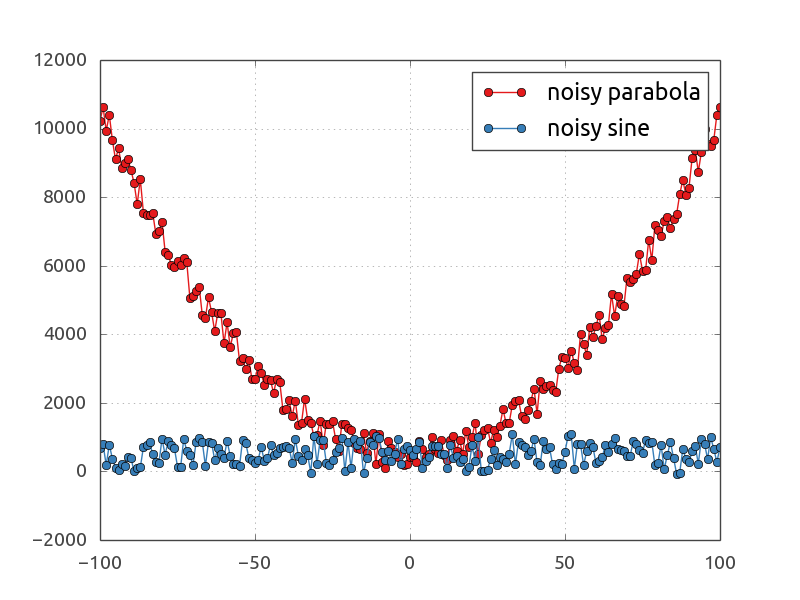

# Nim Matplotlib

Simple wrapper of matplotlib for Nim.

```nimrod
import matplotlib
import sequtils
import sugar
import random
import lenientops
import math

let xs = toSeq(-100 .. +100)
let ys1 = xs.map(x => x*x + rand(1000.0))
let ys2 = xs.map(x => sin(x.float)*100 + rand(1000.0))

# create a plotting script and add basic plotting instructions
var p = createSinglePlot()
p.plot(xs, ys1, "o-", label := "noisy parabola")
p.plot(xs, ys2, "o-", label := "noisy sine")
p.enableGrid()
p.legend()

# this adds `plt.savefig` for writing the plot to file
p.saveFigure("imgs/basicPlot.png")

# this adds `plt.show()` for interactive plotting
p.show()

# finally: store & run the Python script
p.run()
```

Output:


